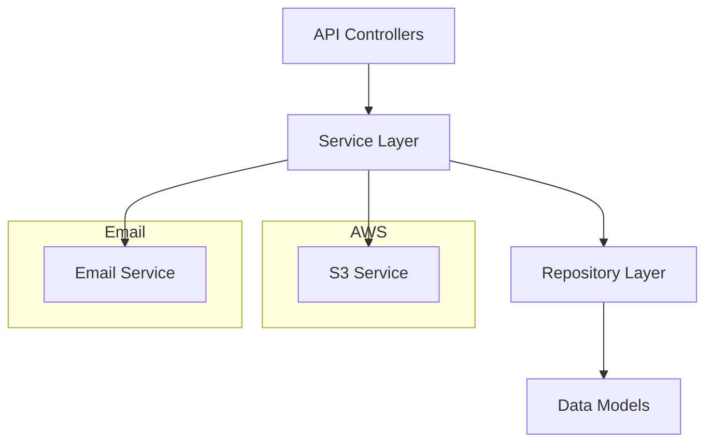

# Mother's Kitchen Backend

Mother's Kitchen Backend is a Java/Spring-based server application that manages the business logic, data, and workflows for an online kitchen/food-ordering system. The backend handles user registration and authentication, order processing, product inventory management, file uploads to AWS S3, and email notifications for both customer and administrative events.

> [!NOTE]
> This documentation covers the source-backed features, configuration, and usage patterns detected in the repository.

---

## Introduction

Mother's Kitchen Backend is the backend service for managing e-commerce operations such as user management, inventory, and order processing. It leverages Spring Boot, supports multipart file uploads to AWS S3, and provides both public and common API endpoints for users, orders, inventory, and health checks.

Key Java areas include DTOs for data transfer, service layers for business logic, repositories for persistence, S3 integration for image/file uploads, and robust Spring Security configuration.

---

## Features

The backend is organized around several core domains and system services. Below is a summary of supported features and their source evidence.

### User Management

- User signup and login (`src/main/java/com/motherskitchen/backend/Controller/Public/User.java`)
- Supports roles and JWT-based authentication
- User data transfer objects for registration and login (`src/main/java/com/motherskitchen/backend/DTO/User/SignUpDTO.java`, `src/main/java/com/motherskitchen/backend/DTO/User/LoginDTO.java`)
- Sends account creation emails on successful registration (`src/main/java/com/motherskitchen/backend/DTO/Email/AccountEmailCreationDTO.java`)

### Order Management

- Create new orders (`src/main/java/com/motherskitchen/backend/Controller/Public/Orders.java`)
- Retrieve all orders or filter by status
- Orders and items structured using DTOs (`src/main/java/com/motherskitchen/backend/DTO/Order/OrdersCreateDTO.java`, `src/main/java/com/motherskitchen/backend/DTO/Order/OrderItemDTO.java`)
- Email notification on order creation (`src/main/java/com/motherskitchen/backend/DTO/Email/OrderEmail.java`)

### Inventory Management

- Add new products with image upload support (`src/main/java/com/motherskitchen/backend/Controller/Public/Inventory.java`)
- List all products or only active ones
- Product and inventory DTOs (`src/main/java/com/motherskitchen/backend/DTO/Inventory/InventoryDTO.java`, `src/main/java/com/motherskitchen/backend/DTO/Inventory/ProductDTO.java`)
- Uses S3 for storing product images (`src/main/java/com/motherskitchen/backend/Aws/S3/S3Service.java`)

### File Uploads (AWS S3 Integration)

- Upload images/files to S3 buckets
- Retrieve URLs and keys for uploaded files
- Remove files from S3 when necessary
- S3 configuration and service (`src/main/java/com/motherskitchen/backend/Aws/S3/S3Config.java`, `src/main/java/com/motherskitchen/backend/Aws/S3/S3Service.java`, `src/main/java/com/motherskitchen/backend/Aws/S3/UploadDTO.java`)

### Party Order Requests

- Special endpoint for party orders (`src/main/java/com/motherskitchen/backend/Controller/Common/PartyController.java`)
- Sends an email request when a party order is placed (`src/main/java/com/motherskitchen/backend/DTO/Party/PartyOrderRequest.java`)

### Health Checks

- Basic health endpoint for system monitoring (`src/main/java/com/motherskitchen/backend/Controller/Common/HealthController.java`)

### Security

- Spring Security configuration for authentication and authorization (`src/main/java/com/motherskitchen/backend/Configuration/SecurityConfig.java`)
- BCrypt password encoding
- JWT authentication filter integration

---

## Configuration

Configuration is primarily managed through Spring properties and Java config classes. The following files and classes are relevant for setup:

- **Application Properties**:
  - `src/main/resources/application.properties`
  - `src/main/resources/application-dev.properties`
  - `src/main/resources/application-prod.properties`

  These property files include environment-specific settings such as AWS credentials, region, and other Spring Boot configurations.

- **AWS S3 Configuration**:
  - `src/main/java/com/motherskitchen/backend/Aws/S3/S3Config.java`
    Configures the AWS S3 client using properties loaded from the environment files. Keys such as `aws.access.key`, `aws.secret.key`, and `aws.region` must be provided.

- **Spring Beans and Security**:
  - `src/main/java/com/motherskitchen/backend/Configuration/AppConfig.java`
    Provides beans like the `RestTemplate` for HTTP requests.
  - `src/main/java/com/motherskitchen/backend/Configuration/SecurityConfig.java`
    Sets up security filters, password encoding, and authentication manager.

- **Project Build**:
  - `pom.xml`
    Maven POM defines dependencies and build plugins for the Spring Boot application.

> [!IMPORTANT]
> Ensure your AWS credentials and region are set in the environment or properties files before running the backend.

---

## Usage

Below is a summary of the public API endpoints and their request/response structure as defined by the controller classes. Each endpoint is documented with its method, path, and data expectations.

---

### User Signup (`POST /api/v1/auth/signup`)

#### Create a new user account

```api
{
    "title": "User Signup",
    "description": "Register a new user and receive account creation confirmation.",
    "method": "POST",
    "baseUrl": "http://localhost:8080",
    "endpoint": "/api/v1/auth/signup",
    "headers": [
        {
            "key": "Content-Type",
            "value": "application/json",
            "required": true
        }
    ],
    "bodyType": "json",
    "requestBody": "{\n  \"name\": \"Jane Doe\",\n  \"email\": \"jane@example.com\",\n  \"password\": \"password123\"\n}",
    "responses": {
        "200": {
            "description": "Success",
            "body": "{\n  \"id\": \"uuid-value\",\n  \"name\": \"Jane Doe\",\n  \"email\": \"jane@example.com\"\n}"
        },
        "400": {
            "description": "Validation error",
            "body": "{\n  \"error\": \"Email already exists\"\n}"
        }
    }
}
```

---

### User Login (`POST /api/v1/auth/login`)

#### Authenticate a user and receive a JWT token

```api
{
    "title": "User Login",
    "description": "Authenticate user credentials and receive a JWT token.",
    "method": "POST",
    "baseUrl": "http://localhost:8080",
    "endpoint": "/api/v1/auth/login",
    "headers": [
        {
            "key": "Content-Type",
            "value": "application/json",
            "required": true
        }
    ],
    "bodyType": "json",
    "requestBody": "{\n  \"email\": \"jane@example.com\",\n  \"password\": \"password123\"\n}",
    "responses": {
        "200": {
            "description": "Authentication success",
            "body": "{\n  \"token\": \"jwt-token-value\",\n  \"role\": \"USER\"\n}"
        },
        "401": {
            "description": "Authentication failure",
            "body": "{\n  \"error\": \"Invalid credentials\"\n}"
        }
    }
}
```

---

### Create Order (`POST /api/v1/orders/`)

#### Place a new order

```api
{
    "title": "Create Order",
    "description": "Place a new order with customer and order details.",
    "method": "POST",
    "baseUrl": "http://localhost:8080",
    "endpoint": "/api/v1/orders/",
    "headers": [
        {
            "key": "Content-Type",
            "value": "application/json",
            "required": true
        }
    ],
    "bodyType": "json",
    "requestBody": "{\n  \"name\": \"Jane Doe\",\n  \"email\": \"jane@example.com\",\n  \"phone\": \"1234567890\",\n  \"payment\": \"card\",\n  \"items\": [\n    { \"itemId\": \"uuid-product-1\", \"name\": \"Pizza\", \"quantity\": 2, \"price\": 10.0 }\n  ],\n  \"day\": \"Friday\",\n  \"orderType\": \"delivery\",\n  \"deliveryCharge\": 30,\n  \"address\": { \"streetAddress\": \"123 Main St\", \"city\": \"Metropolis\", \"postalcode\": \"12345\" },\n  \"notes\": \"Leave at door\"\n}",
    "responses": {
        "201": {
            "description": "Order created",
            "body": "{\n  \"id\": \"order-uuid-value\"\n}"
        },
        "500": {
            "description": "Server error",
            "body": "{\n  \"error\": \"Unable to create order right now. Please retry later.\"\n}"
        }
    }
}
```

---

### Get All Products (`GET /api/v1/inventory/all`)

#### Retrieve all products from inventory

```api
{
    "title": "Get All Products",
    "description": "Fetch a list of all products in the inventory.",
    "method": "GET",
    "baseUrl": "http://localhost:8080",
    "endpoint": "/api/v1/inventory/all",
    "headers": [],
    "bodyType": "none",
    "responses": {
        "200": {
            "description": "List of products",
            "body": "[\n  {\n    \"id\": \"uuid-product-1\",\n    \"name\": \"Pizza\",\n    \"description\": \"Delicious cheese pizza\",\n    \"price\": 10.0,\n    \"category\": \"Main\",\n    \"image\": \"https://s3.amazonaws.com/...\",\n    \"isActive\": true\n  }\n]"
        }
    }
}
```

---

### Add New Product (`POST /api/v1/inventory/add`)

#### Add a new product to the inventory (multipart with image upload)

```api
{
    "title": "Add New Product",
    "description": "Add a new product with details and image upload.",
    "method": "POST",
    "baseUrl": "http://localhost:8080",
    "endpoint": "/api/v1/inventory/add",
    "headers": [
        {
            "key": "Content-Type",
            "value": "multipart/form-data",
            "required": true
        }
    ],
    "formData": [
        {
            "key": "product",
            "value": "JSON string of InventoryDTO",
            "required": true
        },
        {
            "key": "image",
            "value": "Image file",
            "required": true
        }
    ],
    "bodyType": "form",
    "responses": {
        "200": {
            "description": "Product added successfully",
            "body": "{\n  \"id\": \"uuid-product-1\",\n  \"name\": \"Pizza\",\n  \"imageURL\": \"https://s3.amazonaws.com/...\"\n}"
        },
        "400": {
            "description": "Invalid input",
            "body": "{\n  \"error\": \"Unable to add new product\"\n}"
        }
    }
}
```

---

### Health Check (`POST /api/v1/health`)

#### Verify backend health

```api
{
    "title": "Health Check",
    "description": "Check if the backend is running and healthy.",
    "method": "POST",
    "baseUrl": "http://localhost:8080",
    "endpoint": "/api/v1/health",
    "headers": [],
    "bodyType": "none",
    "responses": {
        "200": {
            "description": "Healthy",
            "body": "\"Health OK\""
        }
    }
}
```

---

### Party Order Request (`POST /api/v1/party-order`)

#### Submit a party order request

```api
{
    "title": "Party Order Request",
    "description": "Submit a request for a party order and trigger notification email.",
    "method": "POST",
    "baseUrl": "http://localhost:8080",
    "endpoint": "/api/v1/party-order",
    "headers": [
        {
            "key": "Content-Type",
            "value": "application/json",
            "required": true
        }
    ],
    "bodyType": "json",
    "requestBody": "{\n  \"name\": \"ACME Corp.\",\n  \"email\": \"events@acme.com\",\n  \"phone\": \"1234567890\",\n  \"date\": \"2024-06-01\",\n  \"guests\": \"100\",\n  \"combo\": \"Veg\",\n  \"vegNonVeg\": \"Veg\",\n  \"message\": \"Please arrange for Jain food.\"\n}",
    "responses": {
        "200": {
            "description": "Request processed",
            "body": "\"Successfully\""
        }
    }
}
```

---

## Architecture Overview

Mother's Kitchen Backend is structured into controllers, services, repositories, and DTOs. The controllers expose REST endpoints under `/api/v1` for major workflows. Spring Security provides authentication and authorization, supported by JWT tokens and password encoding.



- **API Controllers**: Handle HTTP requests and responses.
- **Service Layer**: Encapsulates business logic for users, orders, inventory, and utility actions.
- **Repository Layer**: Manages persistence with underlying database.
- **S3 Service**: Handles image uploads and retrievals.
- **Email Service**: Sends transactional emails for account and order events.

---

## File and Directory Structure

- **src/main/java/com/motherskitchen/backend/Controller/Public/**
  Public REST controllers for Users, Orders, Inventory
- **src/main/java/com/motherskitchen/backend/Controller/Common/**
  Common endpoints for health and party orders
- **src/main/java/com/motherskitchen/backend/DTO/**
  Data Transfer Objects for all domain models
- **src/main/java/com/motherskitchen/backend/Models/**
  Entity/data classes for inventory, orders, users
- **src/main/java/com/motherskitchen/backend/Service/**
  Business logic for inventory, orders, users, email, and S3
- **src/main/java/com/motherskitchen/backend/Aws/S3/**
  AWS S3 configuration and file upload logic
- **src/main/java/com/motherskitchen/backend/Configuration/**
  Application and security configuration
- **src/main/resources/**
  Application property files for environment-specific configuration
- **pom.xml**
  Maven build and dependency configuration

---

> [!TIP]
> Run the backend with the appropriate profile (dev, prod) and ensure your AWS S3 credentials and region are set before starting.

> [!CAUTION]
> File uploads require valid AWS configuration and S3 bucket access. Misconfiguration may result in failed uploads or application errors.

---

For additional code details, refer to the source files under `src/main/java/com/motherskitchen/backend/` and configuration in `src/main/resources/`.
